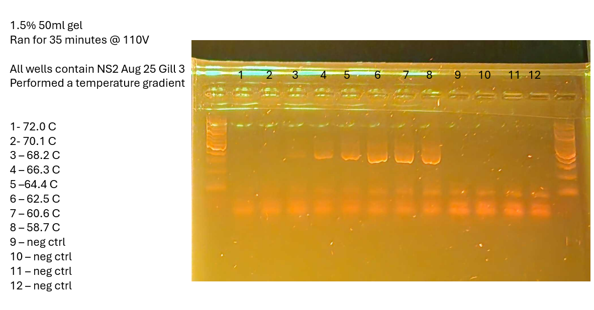

This one I am doing mostly (entirely, save for any questions) on my own!

# Samples 
1 - NSW2 August 25 Gill 3 (temp gradient) + 4 negative controls
1 in back, 8 in front
9 in back, 12 in front (in thermocycler)
# Master Mix Table
Most of these reagents are found in the reagents rack

|                 |                       |                            |                      |
| --------------- | --------------------- | -------------------------- | -------------------- |
| Reagent         | Amount per 1 rxn (uL) | MasterMix Amount (uL) + 5% | Triplicate (uL) + 5% |
| Buffer          | 5                     | 21                         | 63                   |
| dNTP (10mM)     | 0.5                   | 2.1                        | 6.3                  |
| F Primer (10uM) | 1                     | 4.2                        | 12.6                 |
| R Primer (10uM) | 1                     | 4.2                        | 12.6                 |
| Polymerase      | 0.25                  | 1.05                       | 3.15                 |
| Albumin         | 0.25                  | 1.05                       | 3.15                 |
| Water           | 16                    | 67.2                       | 201.6                |
| DNA             | 1                     |                            |                      |
| Total           | 25                    | 100.8                      | 302.4                |

# Photo of Gel

gel is 50ml, made with .75g of agarose and 1ul of gel-red
Gel was ran for 35 minutes at 110V
