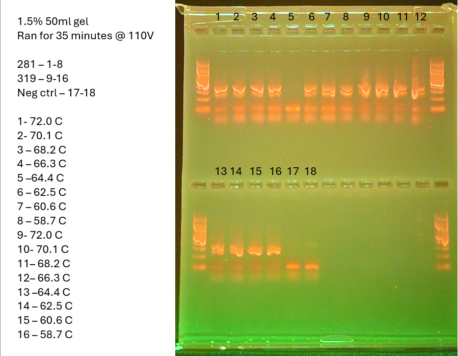

This is a temperature gradient ran on one high and one low concentration sample to determine best annealing temp
# Samples 
Low conc sample - 281 - 4.10ng/ul
High conc sample - 319 - 32.0ng/ul

16S touchdown

1 in back, 8 in front - 281
9 in back, 16 in front - 319
17 and 18 in the 5th and 6th wells (from the back)

# Master Mix Table
HotStart library prep calc in mm_calcs is where this came from

|                 |                       |                            |                      |
| --------------- | --------------------- | -------------------------- | -------------------- |
| Reagent         | Amount per 1 rxn (uL) | MasterMix Amount (uL) + 5% | Triplicate (uL) + 5% |
| Buffer          | 5                     | 31.5                       | 94.5                 |
| dNTP (10mM)     | 0.5                   | 3.15                       | 9.45                 |
| F Primer (10uM) | 1                     | 6.3                        | 18.9                 |
| R Primer (10uM) | 1                     | 6.3                        | 18.9                 |
| Polymerase      | 0.25                  | 1.575                      | 4.725                |
| Albumin         | 0.25                  | 1.575                      | 4.725                |
| Water           | 16                    | 100.8                      | 302.4                |
| DNA             | 1                     |                            |                      |
| Total           | 25                    | 151.2                      | 453.6                |
# Photo of Gel

gel is 50ml, made with .75g of agarose and 1ul of gel-red
Gel was ran for 35 minutes at 110V
ran for 5 minutes on 16S touchdown, then ran at 16SGrad. Was supposed to do grad.

Lessons learned here - If you're not feeling 100% well and up to it, don't bother. There were numerous mistakes today. From selecting the wrong program, to skipping well five, and i hope that is not contamination in wells 17 and 18 and some primer-flymer nonsense can explain it. Probably not. Pbbbbbt. Top right ladder looks insanely good though. I just have to figure out how to repeat that result.

Also, try using new running buffer to prevent the squiggles. Also, using less loading dye may help here. I have been using a pretty much 1:1 ratio, next time try .5:1?

I also notice most of my bands seem to have a weird left side, I think this is due to me being left handed and squirting the DNA into the corner. Perhaps try to ensure a more central pipetting position next time?

