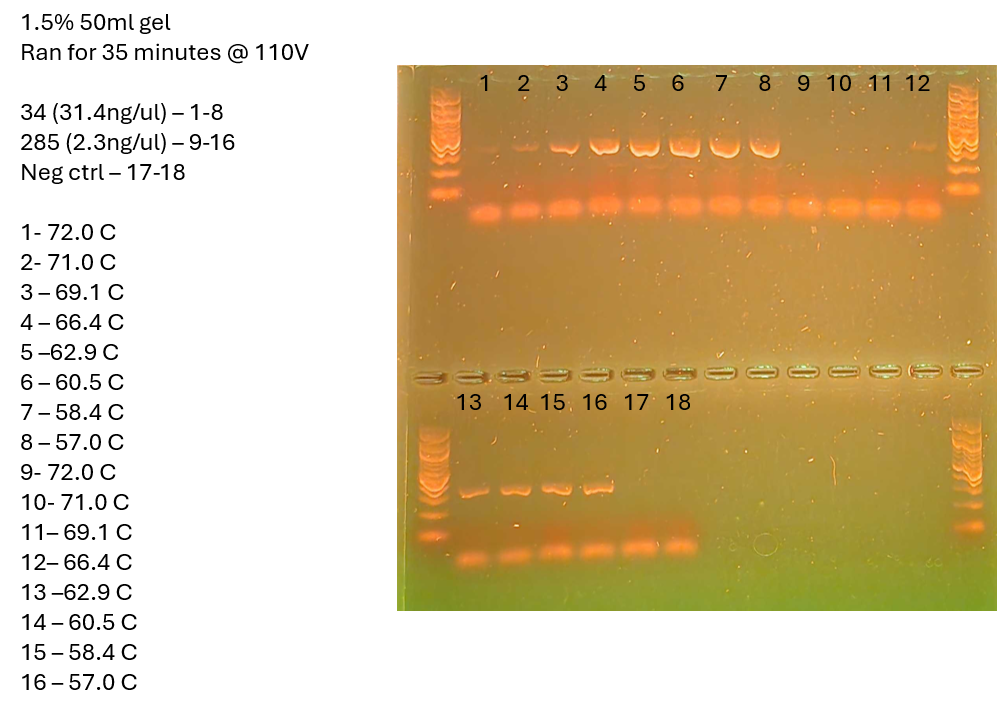

This is a temperature gradient ran on one high and one low concentration sample to determine best annealing temp - done properly
# Samples 
Low conc sample - 285 - 2.3ng/ul - tubes 9-16, 9 in back
High conc sample - 34 - 31.4ng/ul - tubes 1-8, 1 in back
tube 17 & 18 - neg ctrl - 17 in 5th row, 18 in 6th

16S GRAD
# Master Mix Table
HotStart library prep calc in mm_calcs is where this came from

|                 |                       |                            |                      |
| --------------- | --------------------- | -------------------------- | -------------------- |
| Reagent         | Amount per 1 rxn (uL) | MasterMix Amount (uL) + 5% | Triplicate (uL) + 5% |
| Buffer          | 5                     | 94.5                       | 283.5                |
| dNTP (10mM)     | 0.5                   | 9.45                       | 28.35                |
| F Primer (10uM) | 1                     | 18.9                       | 56.7                 |
| R Primer (10uM) | 1                     | 18.9                       | 56.7                 |
| Polymerase      | 0.25                  | 4.725                      | 14.175               |
| Albumin         | 0.25                  | 4.725                      | 14.175               |
| Water           | 16                    | 302.4                      | 907.2                |
| DNA             | 1                     |                            |                      |
| Total           | 25                    | 453.6                      | 1360.8               |

# Photo of Gel

gel is 50ml, made with .75g of agarose and 1ul of gel-red
Gel was ran for 35 minutes at 110V
