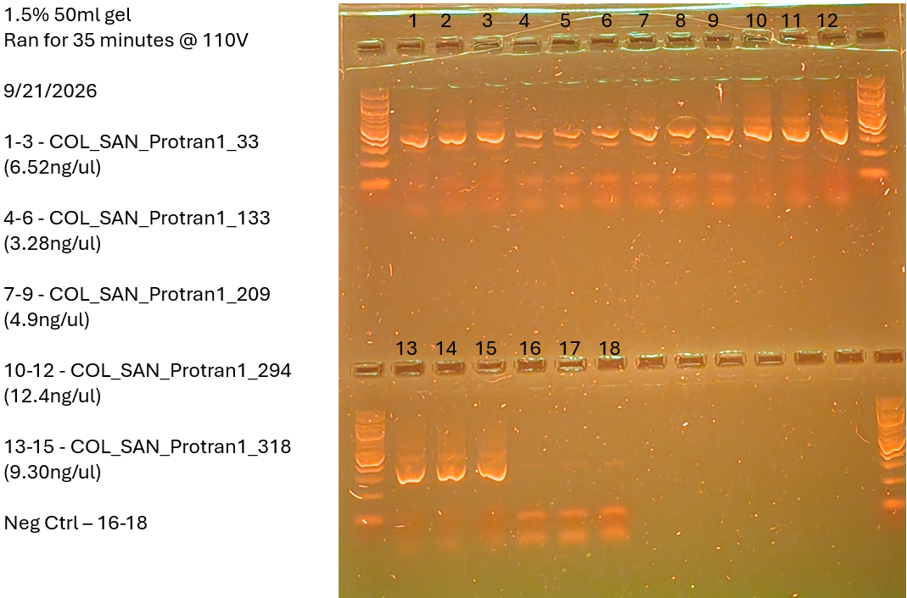

Okay, so our first attempt at PCRing our actual samples. The plan today is to do 16 samples and 2 negs (total of 18 tubes), make sure to go through and mark the samples on both the Obsidian list, as well as the metadata tracker. The program I created for this is ;16S_63C_BRAN', hopefully it works!
# Samples 
COL_SAN_Protran1_33 - 1 - 3
COL_SAN_Protran1_133 - 4 - 6
COL_SAN_Protran1_209 - 7 - 9
COL_SAN_Protran1_294 - 10 - 12
COL_SAN_Protran1_318 - 13 - 15
Neg Ctrl - 16 - 18

1 in back
9 in back
17 in back
# Master Mix Table
HotStart library prep calc in mm_calcs is where this came from
- **Mix the following agents via vortex:** Buffer, primers
0N primers were used for this (Just grabbed the tubes and am using them for the first time on 9/21)

|   |   |   |   |
|---|---|---|---|
|Reagent|Amount per 1 rxn (uL)|MasterMix Amount (uL) + 5%|Triplicate (uL) + 5%|
|Buffer|5|31.5|94.5|
|dNTP (10mM)|0.5|3.15|9.45|
|F Primer (10uM)|1|6.3|18.9|
|R Primer (10uM)|1|6.3|18.9|
|Polymerase|0.25|1.575|4.725|
|Albumin|0.25|1.575|4.725|
|Water|16|100.8|302.4|
|DNA|1|||
|Total|25|151.2|453.6|
# Photo of Gel

gel is 50ml, made with .75g of agarose and 1ul of gel-red
Gel was ran for 35 minutes at 110V
