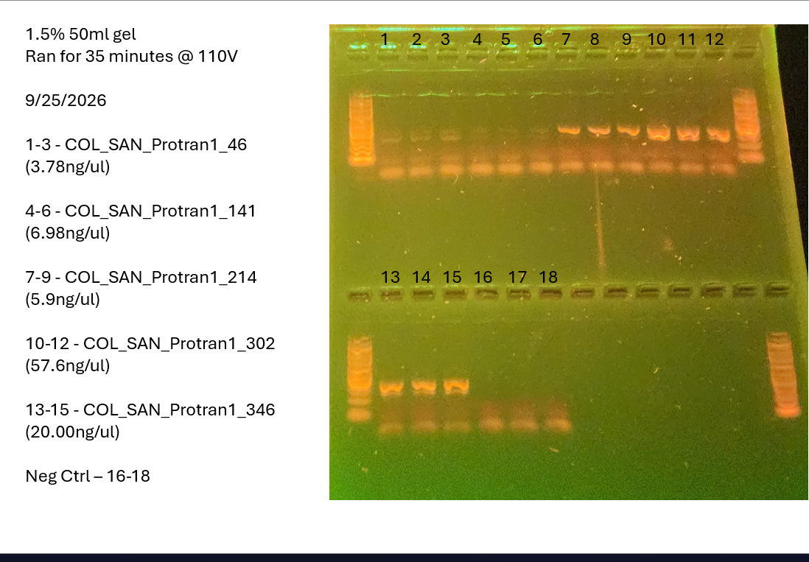

Alright, round two of PCRing our samples. Last time we ran into some issues with smearing and possibly contamination in my negatives. The plan to day is to replace the Q5 reaction buffer, and if I am still seeing some bands in my negative the next reagent to replace would be the dNTP aliquot, The water and  primers are not on my radar, but I will replace every reagent in an attempt to ship of theseus my way out of this issue and see if it is a contamination or handling issue.

Also, I am attempting to reduce my cycles from 35 to 30.
# Samples 
46 1-3 (3.78ng/ul)
141 4-6 (6.98ng/ul)
214 7, 18 ,9 (5.9ng/ul)
302 10-12 (57.6ng/ul)
346 -13-15 (20.0ng/ul)
Neg Ctrl 16, 17 , 8.

SWAP 8 and 18!!! Don't know why, but 8 is low on mix. Treat it as a neg ctrl and put what is supposed to go in 8 in 18.

Need to triple check that I am adding enough. Maybe add a bit more (20ul~) water?
# Master Mix Table
HotStart library prep calc in mm_calcs is where this came from
- **Mix the following agents via vortex:** Buffer, primers
0N primers were used for this
Primer 

|   |   |   |   |
|---|---|---|---|
|Reagent|Amount per 1 rxn (uL)|MasterMix Amount (uL) + 5%|Triplicate (uL) + 5%|
|Buffer|5|31.5|94.5|
|dNTP (10mM)|0.5|3.15|9.45|
|F Primer (10uM)|1|6.3|18.9|
|R Primer (10uM)|1|6.3|18.9|
|Polymerase|0.25|1.575|4.725|
|Albumin|0.25|1.575|4.725|
|Water|16|100.8|302.4|
|DNA|1|||
|Total|25|151.2|453.6|
# Photo of Gel
